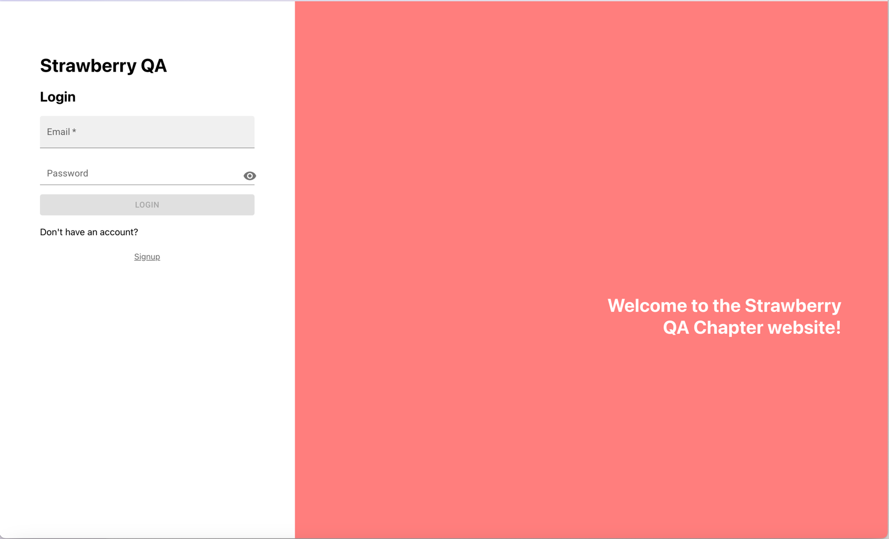

# 🍓 QA Interview Case
Welcome to the Strawberry QA initial interview case! We created this repo specifically for this interview.
Even though this is just a practical exercise, it will help us evaluate your knowledge in a similar scenario as what we currently have/use for our testing framework.

Here are some guidelines in order to make run and work with it.

## Pre-requisites
- You will need to have `node` and `npm` installed in your system. We tested it with the following versions:
```shell
❯ npm --version
10.5.0
❯ node --version
v20.11.1
```

## Steps

- First you will need to fork the repository. We want you to fork it and not create a branch, so we can review your assignment independently. Click the “Fork” button at the top right of the repository page and choose your personal GitHub account to fork the repository.

- Clone the forked repository to your local machine:
```shell
git clone https://github.com/<your-username>/qa-interview-simple-case.git
cd qa-interview-simple-case
```

- Once you have the repo, you will need to install the dependencies:
```shell
npm install
```

- We are using playwright for our E2E tests, so we need to install the supported browsers. For that we run:
```shell
npx playwright install
```

- You can also run the tests with the following command `npm run test:e2e` or `npm run test:e2e:headed`

- Now you are ready to run the app locally using one of the scripts defined in `package.json`. You can try with `npm run dev` and you should see the app running locally and a link to open it in your preferred browser:



## Tasks 📘
- First of all take some minutes to explore a bit the page. As you can see it's a simple login form and a sign up form. We are using localStorage as our db to keep things simple for this case. Keep in mind that this is just a practice case so there might be typos, some bugs and overall many things that could be improved. So let's try to focus on the tasks themselves!

#### ⭐ Task 1: Code Review
- If you open the repo in your preferred IDE, you will see a folder named `tests`, there you can see a file named `login.test.ts`. Now imagine that you have a task to improve the code on this file. We would like you to create a pull request with the improvements that you would make to this file.

#### ⭐ Task 2: Implement a test to verify the Sign Up functionality
- As a second task we would like you to create a test for the Sign Up functionality. We don't need you to covers each and every case of the Sign Up, but at least a happy path that verifies that you can create a new account and sign in with it.

> [!TIP]
> There are no restrictions in terms of what you can do for `Task 1` and `Task 2`, so if you think that you need to do something outside the mentioned files, feel free to change the project structure, split into different files, extract functions, apply design patterns, etc

#### ⭐ Task 3: Share it!
- Once you are done with it, share the link of the forked repository with Sofie so we can review it.

> [!IMPORTANT]
> We need to be able to review the assignment, so you have to make sure that the forked repo is public.